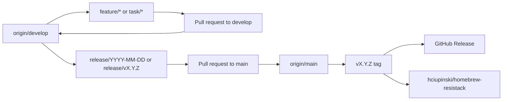

# Release Flow

This document defines the production CI/CD flow for ResistanceStack.

## Branch Model



Rules:

- Developers branch from `origin/develop`.
- Normal work is merged back into `origin/develop`.
- Only `release/*` branches may be merged into `origin/main`.
- A tag pushed from `main` triggers the release workflow.
- The release workflow publishes a GitHub Release and updates the Homebrew tap.

## Daily Development

1. Start from `develop`:

```bash
git fetch origin
git checkout develop
git pull origin develop
```

2. Create a feature branch:

```bash
git checkout -b feature/my-change
```

3. Work locally and run tests:

```bash
GOCACHE=$(pwd)/.cache/go-build GOMODCACHE=$(pwd)/.cache/go-mod go test ./...
```

4. Push and open a pull request into `develop`:

```bash
git push -u origin feature/my-change
```

Required CI checks should pass before merge.

## Release Branch

Create a release branch from `develop`:

```bash
git fetch origin
git checkout develop
git pull origin develop
git checkout -b release/$(date +%Y-%m-%d)
git push -u origin release/$(date +%Y-%m-%d)
```

Open a pull request:

```text
release/YYYY-MM-DD -> main
```

The `Branch Policy` workflow fails PRs to `main` unless the source branch starts with `release/`.

## Tagging a Release

After the release PR is merged into `main`:

```bash
git fetch origin
git checkout main
git pull origin main
git tag v0.1.0
git push origin v0.1.0
```

The tag triggers:

```text
.github/workflows/release.yml
```

The release workflow:

1. runs tests,
2. builds darwin/linux binaries for amd64/arm64,
3. creates archives and checksums,
4. creates a GitHub Release,
5. updates the Homebrew tap repository.

## Required GitHub Secrets

In the main app repository `hciupinski/resistancestack`, configure:

```text
TAP_GITHUB_TOKEN
```

This token must be able to push to:

```text
hciupinski/homebrew-resistack
```

Recommended token scope:

- fine-grained personal access token,
- repository access limited to `hciupinski/homebrew-resistack`,
- contents: read/write.

`GITHUB_TOKEN` is provided automatically by GitHub Actions and is used only for the app repository release.

## Required GitHub Repositories

Application repository:

```text
hciupinski/resistancestack
```

Homebrew tap repository:

```text
hciupinski/homebrew-resistack
```

Tap layout:

```text
homebrew-resistack/
└── Formula/
    └── resistack.rb
```

The formula is generated by GoReleaser. Do not edit it manually unless the release workflow fails and you need a hotfix.

## Required Branch Protection

Configure branch protection in GitHub settings.

### `main`

Recommended rules:

- Require pull request before merging.
- Require approvals.
- Require status checks:
  - `Branch Policy / main accepts release branches only`
  - `CI / Go test`
  - `CI / Build CLI`
  - `Lint / golangci-lint`
  - `Security / govulncheck`
- Require branches to be up to date before merging.
- Restrict who can push to matching branches.
- Do not allow direct pushes to `main`.

### `develop`

Recommended rules:

- Require pull request before merging.
- Require status checks:
  - `CI / Go test`
  - `CI / Build CLI`
  - `Lint / golangci-lint`
  - `Security / govulncheck`
- Do not allow direct pushes unless you explicitly want fast internal iteration.

## Installation After Release

Users can install from the generated tap with:

```bash
brew install hciupinski/resistack/resistack
```

After adding the tap once:

```bash
brew tap hciupinski/resistack
brew install resistack
```

Upgrade:

```bash
brew update
brew upgrade resistack
```

Note: `brew install hciupinski/resistack` is not the standard Homebrew formula address. Use `brew install hciupinski/resistack/resistack` for one-command install from the custom tap.

## Emergency Release Fix

If the GitHub Release succeeded but the tap update failed:

1. Fix `.goreleaser.yml` or the `TAP_GITHUB_TOKEN` permissions.
2. Delete the failed release and tag only if the release artifacts are wrong.
3. Prefer creating a patch tag:

```bash
git tag v0.1.1
git push origin v0.1.1
```

Avoid force-moving public tags once users may have installed them.
